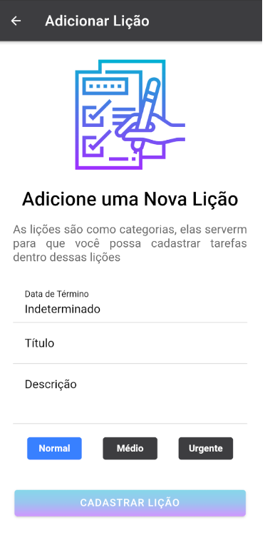
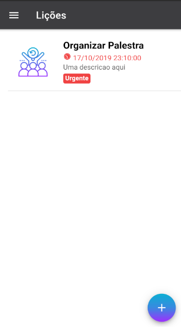
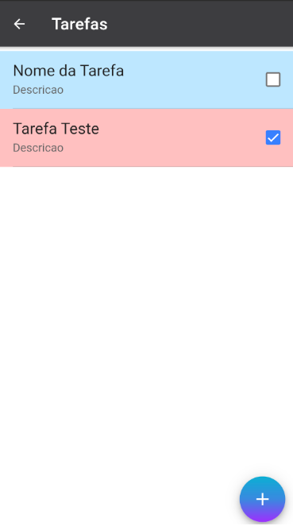

# Awesome To Do List - Ionic 3

It's a simple to do list app. Icons can be use and the tasks can have sub tasks inside it.

### Installation

Install the dependencies

```sh
$ npm install
```

### Serve
To serve in the browser

```sh
$ ionic serve
```

### To Add Platforms
```sh
$ cordova platform add android
$ cordova platform add ios
```

### Run Platforms
To run in avd, device

```sh
$ ionic run android
$ ionic run ios
```

### Screenshots
Some screenshots example

#### Adding Task


#### Tasks List


#### Sub Tasks Check List
